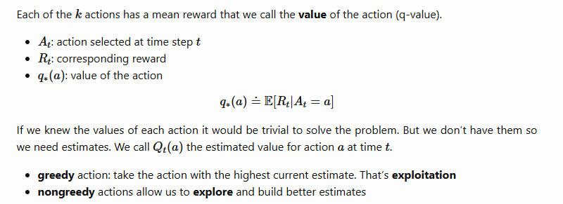

# k-armed bandit problem.
A k-armed bandit problem is one of the foremost problems in RL. It depicts the evaluative aspect of reinforcement learning where an evaluative feedback indicates how good the action taken was.
The k-armed bandit is inspired by the slot machines you see in casinos. They have only one lever and are referred to as the one armed bandits. 
In the k-armed bandit, we have more than one lever. Thus having k-arms, and having repeated choice among k-actions. After each choice we receive a reward 
chosen from a stationary distribution that depends on the action chosen.

## Objective 
The objective here is to maximize the rewards over some time period.

## Action-Value methods.

These are methods used to calculate the estimates Qa(t) for our action at time t.
One natural way to do that is to average the rewards actually received (sample average).

$$
Q_t(a) = \frac{\sum_{i=1}^{t-1} R_i \cdot \mathbb{1}_{A_i = a}}
{\sum_{i=1}^{t-1} \mathbb{1}_{A_i = a}}
$$

which means:

$$
Q_t(a) =
\frac{
\text{total reward received from action } a \text{ before time } t
}{
\text{number of times action } a \text{ was selected before time } t
}
$$

## Indicator Function Example

The indicator function is written as:

$$
\mathbb{1}_{A_i = a}
$$

This means:

$$
\mathbb{1}_{A_i = a} =
\begin{cases}
1, & \text{if } A_i = a \\
0, & \text{if } A_i \neq a
\end{cases}
$$

In simple words, the indicator function checks whether the action taken at time $i$ was action $a$.

If the action was $a$, the indicator becomes $1$.

If the action was not $a$, the indicator becomes $0$.

So it filters only the rewards from the action we care about.

---

## Example

Suppose we are interested in action $A$.

| Time $(i)$ | Action $(A_i)$ | Reward $(R_i)$ | $\mathbb{1}_{A_i = A}$ | $R_i \cdot \mathbb{1}_{A_i = A}$ |
|---|---|---:|---:|---:|
| 1 | A | 2 | 1 | 2 |
| 2 | B | 5 | 0 | 0 |
| 3 | A | 4 | 1 | 4 |
| 4 | C | 1 | 0 | 0 |
| 5 | A | 3 | 1 | 3 |

The indicator function keeps only the rewards from action $A$.

So the rewards from action $A$ are:

$$
2, 4, 3
$$

The rewards from other actions are ignored because the indicator becomes $0$.

---

## Numerator

The numerator is the total reward received from action $A$ before time $t$:

$$
2 + 0 + 4 + 0 + 3 = 9
$$

So:

$$
\sum_{i=1}^{t-1} R_i \cdot \mathbb{1}_{A_i = A} = 9
$$

---

## Denominator

The denominator is the number of times action $A$ was selected before time $t$:

$$
1 + 0 + 1 + 0 + 1 = 3
$$

So:

$$
\sum_{i=1}^{t-1} \mathbb{1}_{A_i = A} = 3
$$

---

## Action-value estimate

The action-value estimate is:

$$
Q_t(A) =
\frac{
\sum_{i=1}^{t-1} R_i \cdot \mathbb{1}_{A_i = A}
}{
\sum_{i=1}^{t-1} \mathbb{1}_{A_i = A}
}
$$

Substituting the values:

$$
Q_t(A) = \frac{9}{3}
$$

Therefore:

$$
Q_t(A) = 3
$$

---

## Intuition

$Q_t(A)$ is the estimated value of action $A$ at time $t$.

It is calculated as:

$$
Q_t(A) =
\frac{
\text{total reward received from action } A \text{ before time } t
}{
\text{number of times action } A \text{ was selected before time } t
}
$$

So in simple words:

> The value of an action is the average reward received from choosing that action so far.

For this example, action $A$ gave rewards $2$, $4$, and $3$.

So the estimated value of action $A$ is:

$$
Q_t(A) = \frac{2 + 4 + 3}{3} = 3
$$